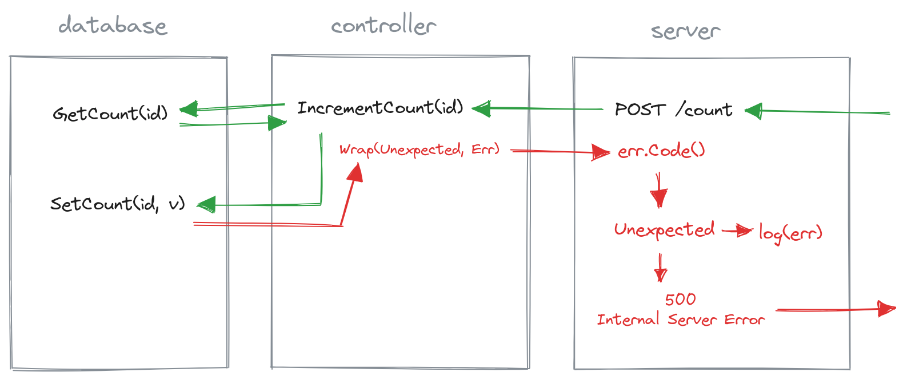

# examples

Here you can find a conclusive example on how whoops can be used to control error behavior in a very
simple REST API application with a database, a controller and corresponding route handlers.

VBelow you can see a visualization on how an unexpected database error propagates through the different layers of the application.

